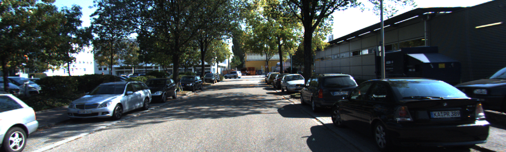
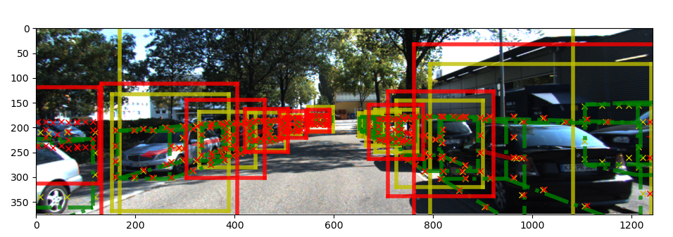
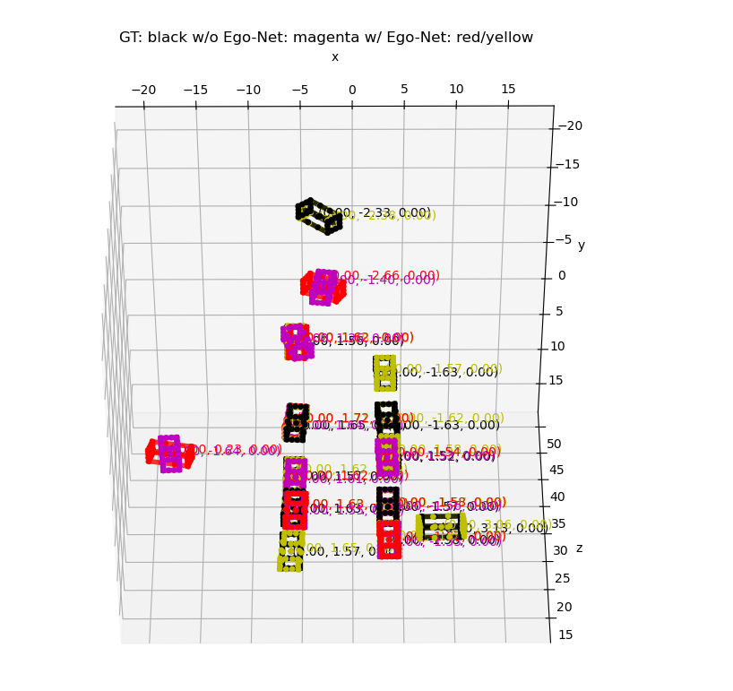

[](https://paperswithcode.com/sota/vehicle-pose-estimation-on-kitti-cars-hard?p=exploring-intermediate-representation-for)
# Vehicle Pose Estimation
This repository is built based on https://github.com/Nicholasli1995/EgoNet.

## Inference Demo

Input image:


Results:



## Building Instruction

Building environment: Ubuntu 22.04, RTX 4090, CUDA 12.3

```bash
$ cd env
$ conda env create -f environment.yml
$ conda activate EgoNet

```

Refer to https://github.com/Nicholasli1995/EgoNet for following steps.
